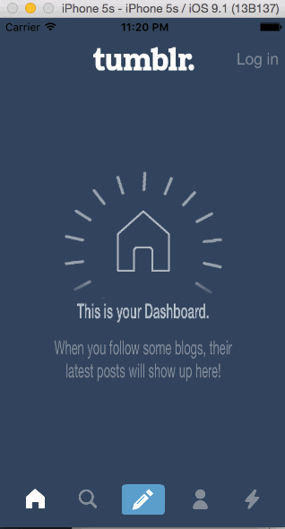

# tumblr-w4

This is an iOS demo appliction to leverage animations and gestures to create custom navigation.

Time spent: 6 hours spent in total

Completed user stories:

Required: Tapping on Home, Search, Account, or Trending should show the respective screen and highlight the tab bar button.
Required: Compose button should modally present the compose screen.
Optional: Login button should show animate the login form over the view controller.
Optional: Discover bubble should bob up and down unless the SearchViewController is tapped.

 